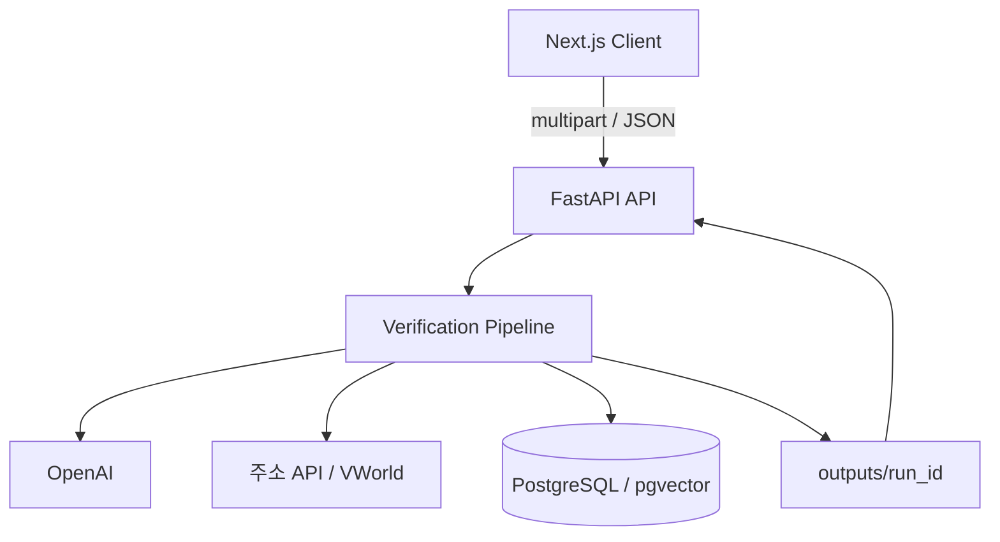
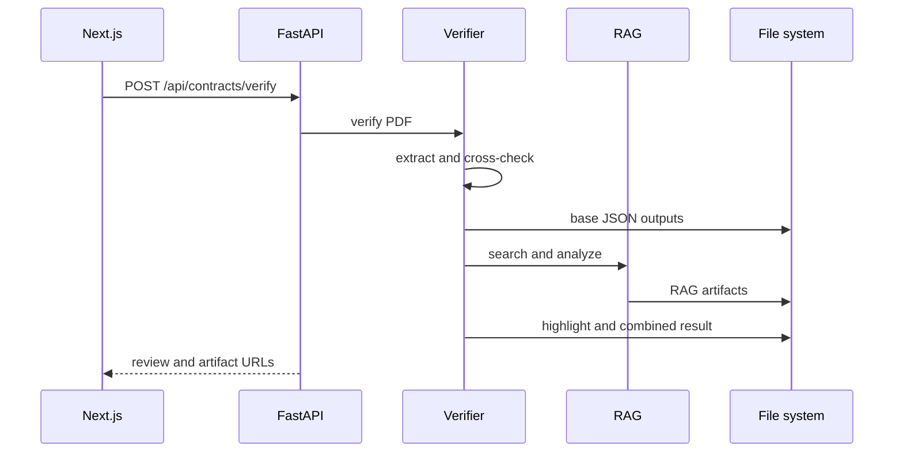
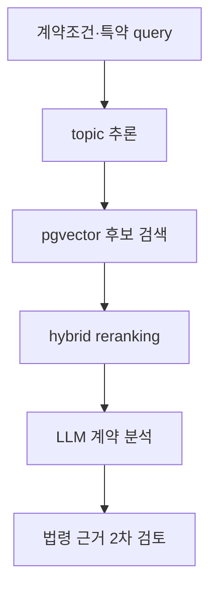
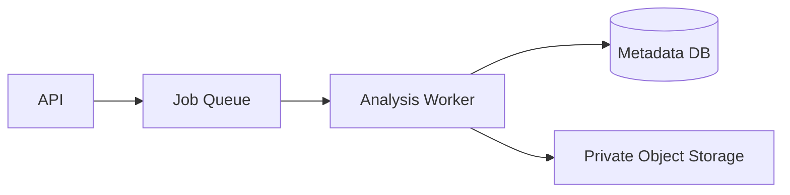

# SafeLease Architecture

[프로젝트 README](../README.md) · [API 명세](API.md) · [백엔드 상세 문서](../backend/README.md)

## 설계 범위

SafeLease는 하나의 저장소에 Next.js 프런트엔드와 FastAPI 백엔드를 둔 로컬 실행형 애플리케이션입니다. 백엔드가 OpenAI, 주소 API, VWorld, PostgreSQL을 직접 호출하고 결과 파일까지 생성하는 단일 프로세스 구조입니다.



메시지 브로커, background worker, 캐시, 별도 object storage는 사용하지 않습니다. 분석 요청을 받은 FastAPI 프로세스가 모든 단계를 동기적으로 실행합니다.

## 요청에서 결과까지



RAG 분석 실패는 `_attach_rag_analysis()`에서 잡아 `failed` 상태로 저장합니다. 반면 추출, 필수 환경변수 로딩, 기본 검증 등 앞 단계의 처리되지 않은 예외는 API의 `500` 응답으로 이어집니다.

## 18단계 분석 파이프라인

단계 번호는 `backend/app/core/progress.py`의 `TOTAL_STEPS = 18`과 각 서비스의 `log_step()` 호출을 기준으로 합니다.

| 단계 | 처리 | 주요 모듈 |
|---:|---|---|
| 1 | 계약서 검증 시작 | `contract_verifier.py` |
| 2–7 | PDF 업로드, OpenAI 구조화 추출, 응답 파싱·복구 | `contract_extractor.py` |
| 8 | 검증 입력 정규화 | `contract_normalizer.py` |
| 9 | 목적물 주소 및 동·층·호 검증 | `address_validator.py` |
| 10 | 임대인·임차인 주소 검증 | `address_validator.py` |
| 11 | 중개업 정보 조회 | `broker_validator.py` |
| 12 | 환산월세와 참고 통계 비교 | `rent_reference_service.py` |
| 13 | 규칙 기반 finding 생성·종합 | `verification_analysis.py` |
| 14 | 추출·검증·분석 JSON 저장 | `verification_persistence.py` |
| 15 | RAG 검색 및 근거 수집 | `rag_analysis_service.py` |
| 16 | RAG 분석·근거 2차 검토 저장 | `rag_analysis_service.py` |
| 17 | PDF 좌표 추출, 마스킹, 하이라이트 생성 | `pdf_highlight_service.py` |
| 18 | 공개 통합 결과 저장 | `verification_persistence.py` |

2–7단계의 세부 로그는 추출 서비스 내부에서 관리합니다. 현재 단계 정보는 서버 로그에만 출력되며 프런트엔드가 조회할 수 있는 진행률 API는 없습니다.

## 백엔드 모듈 책임

| 경로 | 책임 |
|---|---|
| `app/api.py` | HTTP 입력 검증, history 경로 검증, 예외 변환 |
| `app/services/contract_service.py` | 업로드 임시 파일 수명과 전체 실행 연결 |
| `app/services/contract_extractor.py` | OpenAI 파일 업로드, 추출 prompt, JSON 복구 |
| `app/services/contract_normalizer.py` | 외부 검증 입력으로 축약·정규화 |
| `app/services/contract_verifier.py` | 주소·중개업·임대료 검증 조정 |
| `app/validators/address_validator.py` | 도로명주소 기본·상세주소 검증 |
| `app/validators/broker_validator.py` | Selenium 중개업 조회와 DOM 재시도 |
| `app/services/rent_reference_service.py` | 환산월세, 통계 fallback, 분위 비교 |
| `app/services/verification_analysis.py` | 결과를 finding과 전체 판정으로 변환 |
| `app/services/rag_analysis_service.py` | query, embedding 검색, 재정렬, 분석, 근거 검토 |
| `app/services/pdf_highlight_service.py` | 좌표, redaction, annotation, PNG 생성 |
| `app/services/privacy_masking.py` | 이름·주민등록번호·전화번호 마스킹 |
| `app/services/verification_persistence.py` | 실행별 산출물 저장 |
| `app/services/contract_chat_service.py` | 저장 결과 로딩, 질문 RAG, 답변 생성 |
| `app/presenters/verify_response.py` | 내부 결과를 프런트 응답으로 변환 |

## 계약서 추출과 정규화

```text
PDF
└─ OpenAI file upload
   └─ structured extraction
      ├─ property
      ├─ lessor / lessee
      ├─ payment
      ├─ contract_terms
      ├─ special_terms
      └─ brokers
```

금액과 날짜는 원문과 정규화 값을 함께 유지합니다. 외부 검증 모듈은 전체 추출 객체 대신 `normalize_contract_for_validation()`이 만든 다음 요약 구조를 사용합니다.

- `property`: 주소, 임대할 부분, 면적
- `payment`: 보증금, 월세
- `lessor`, `lessee`: 이름과 주소
- `broker`: 등록번호, 소재지, 상호, 대표자, 시도·시군구

LLM 응답이 JSON으로 파싱되지 않으면 코드 블록 제거, 첫 객체 추출, 잘못된 escape 보정 후 재시도합니다. `SAFELEASE_DEBUG_EXTRACTION=1`일 때만 원문 응답과 복구본을 저장합니다.

## 외부 검증 상태 모델

```json
{
  "status": "success | not_found | partial_match | query_failed",
  "data": {},
  "error_code": null,
  "error_message": null,
  "debug": {}
}
```

- `success`: 조회와 비교 완료
- `not_found`: 요청은 성공했지만 일치 정보 없음
- `partial_match`: 기본 정보는 확인했으나 상세 비교 미완료
- `query_failed`: 입력 부족, 외부 시스템 오류 또는 파싱 실패

규칙 분석은 이 상태와 값 비교를 `finding`으로 변환합니다. error가 하나 이상이면 `주의`, warning만 있으면 `보통`, 둘 다 없으면 `양호`로 요약합니다.

## 임대료 참고 통계

```text
환산월세(만원) = 월세(만원) + 보증금(만원) × 0.045 ÷ 12
```

`rent_reference_stats`에서 다음 우선순위로 통계를 선택합니다.

1. `dong_area`: 법정동 + 면적 구간, 표본 10건 이상
2. `area`: 시군구 + 면적 구간
3. `dong`: 법정동 전체
4. `region`: 시군구 전체

P25–P75를 일반 참고 범위로 사용하고 P75와 P90 초과를 서로 다른 경고로 구분합니다. 표본 30건 이상은 `strong`, 미만은 `weak` 신뢰도로 표시합니다. 이는 매물 감정이나 적정 임대료 판정이 아닌 참고 통계입니다.

## RAG 검색과 분석



검색 단위는 보증금, 잔금, 월 차임, 지급 방식, 임대차 기간, 목적물 표시, 진단 항목, 개별 특약입니다.

| 테이블 | 역할 |
|---|---|
| `rent_reference_stats` | 지역·면적별 임대료 참고 통계 |
| `source_documents` | 법령·가이드 원본 메타데이터 |
| `source_chunks` | 법령 조문과 가이드 문단 |
| `source_chunk_embeddings` | 문단 embedding |
| `clause_library` | 위험·유리 특약 라이브러리 |
| `clause_library_embeddings` | 특약 embedding |

벡터 유사도만으로 최종 근거를 결정하지 않습니다. topic과 fallback topic을 정한 뒤 법조문 우선순위, primary authority, token overlap, embedding similarity를 조합해 후보를 재정렬합니다.

첫 LLM 호출은 계약조건·특약 판단을 생성하고, 두 번째 호출은 법령 후보를 `direct`, `supporting`, `irrelevant`로 분류합니다. 2차 검토 실패 시 `legal_basis_verification.status = failed`를 기록합니다.

> 저장소에는 DB migration과 seed 스크립트가 없습니다. 위 테이블이 준비되지 않은 새 환경에서는 임대료 비교와 RAG를 그대로 실행할 수 없습니다.

## PDF 좌표와 마스킹

`pdf_highlight_service.py`는 PyMuPDF의 word, line, block 정보를 이용합니다.

1. 페이지별 텍스트 인덱스 생성
2. anchor와 값으로 주요 필드 탐색
3. 계약조건·특약의 여러 줄 텍스트 탐색
4. finding과 RAG 판단을 `field_path`에 연결
5. 이름·주민등록번호·전화번호 redaction
6. 판정 수준별 PDF annotation 생성
7. 원본과 하이라이트 PNG 렌더링

좌표를 찾지 못한 항목은 결과 JSON에는 남지만 PDF annotation은 생성되지 않을 수 있습니다.

## 실행별 파일 저장

실행 ID는 `YYYYMMDD_HHMMSS_{uuid 8자리}` 형식입니다.

```text
backend/outputs/{run_id}/
├── extracted_contract.json
├── verification_result.json
├── analysis_result.json
├── rag_result.json
├── rag_llm_payload.json
├── rag_analysis_result.json
├── extraction.json
├── highlighted_findings.json
├── rendered.png
├── highlighted.png
├── highlighted.pdf
└── combined_result.json
```

단계 성공 여부에 따라 일부 파일만 존재할 수 있습니다. history API는 `combined_result.json`이 정상 JSON으로 읽히는 실행만 목록에 포함합니다.

파일 시스템 저장에는 다음 제약이 있습니다.

- 다중 서버 간 기록 공유 불가
- pagination과 검색 없음
- 디렉터리 수정 시각을 생성 시각처럼 사용
- 사용자 소유권과 접근 제어 없음
- 보관 기한, 삭제 작업, 용량 관리 없음

## 프런트엔드 상태

`ContractFlowProvider`가 선택 파일, 분석 상태, 결과, 미리보기 모드, 채팅 상태를 관리합니다.

```text
/              PDF 선택
└─ /analyzing  동기 API 응답 대기
   └─ /result  분석 결과와 artifact 표시

/history
└─ /history/{historyId} → 저장 결과 로딩 → /result
```

분석 결과와 파일명은 `sessionStorage`에도 저장합니다. 이는 페이지 이동 중 상태 보존용이며 서버 인증 세션은 아닙니다.

## 환경변수

| 변수 | 필수 여부 | 사용처 |
|---|---|---|
| `OPENAI_API_KEY` | 필수 | 추출, embedding, RAG, 챗봇 |
| `JUSO_ROAD_API_KEY` | 필수 | 도로명주소 검색 |
| `JUSO_DETAIL_API_KEY` | 필수 | 상세주소 검색 |
| `DATABASE_URL` | 조건부 | PostgreSQL 전체 연결 문자열 |
| `POSTGRES_HOST` 등 | 조건부 | `DATABASE_URL` 미사용 시 |
| `SAFELEASE_DEBUG_EXTRACTION` | 선택 | `1`이면 추출 디버그 저장 |
| `NEXT_PUBLIC_API_BASE_URL` | 선택 | 기본값 `http://127.0.0.1:8000` |

VWorld 조회에는 로컬 Chrome/Chromium과 Selenium 실행 환경이 필요합니다.

## 보안 경계

현재 구현:

- 챗봇 컨텍스트를 `/outputs/*/combined_result.json`으로 제한
- history ID 정규식과 `Path.resolve()`로 경로 이탈 방지
- 공개 JSON의 이름·주민등록번호·전화번호 마스킹
- 하이라이트 PDF의 민감 문자열 redaction
- 로컬 origin으로 제한된 CORS

운영 전 보완:

- 인증과 기록 소유권 확인
- `/outputs` 정적 공개 제거 또는 권한 다운로드 적용
- 원본·산출물 암호화, 만료, 삭제와 감사 로그
- OpenAI에 업로드한 계약서 파일의 명시적 삭제 처리
- PDF MIME·크기·페이지·악성 콘텐츠 검사
- OpenAI 전송 정보 최소화와 데이터 처리 정책 검토
- 내부 예외를 그대로 노출하지 않는 오류 응답 계층

## 장애와 복구

| 실패 지점 | 현재 동작 |
|---|---|
| 추출 JSON 파싱 | 보정 후 재파싱 |
| 주소 API | 상태를 네 종류로 구분 |
| VWorld DOM | 특정 Selenium 오류에 최대 3회 재시도 |
| RAG 전체 단계 | `failed` 기록 후 기본 검증 유지 |
| 법령 근거 2차 검토 | 해당 검토만 `failed` 처리 |
| PDF 좌표 미탐색 | 해당 annotation 누락 가능 |
| FastAPI 프로세스 종료 | 진행 중 요청 소실, 완료 파일만 잔존 |

작업 단위 transaction이나 재개 지점은 없습니다. 일부 파일만 남은 실행 디렉터리는 자동 정리되지 않습니다.

## 확장 방향

실제 서비스로 확장할 경우 HTTP 요청과 분석 작업을 분리하는 것이 우선입니다.



API가 작업 ID를 반환하고 worker가 단계 상태와 재시도를 관리하며 파일을 비공개 저장소에 보관하는 구조입니다. 현재 저장소에는 구현되어 있지 않습니다.
