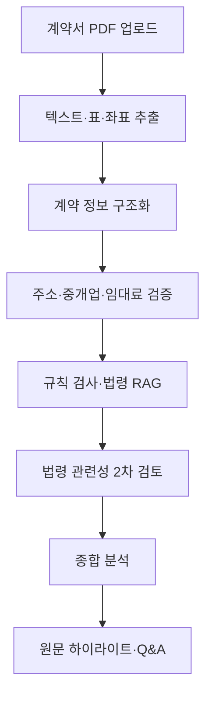

# SafeLease

> 임대차 계약서 PDF의 원문, 외부 검증 결과, 법령 근거, AI 분석을 하나의 추적 가능한 흐름으로 연결한 계약 검토 프로젝트

SafeLease는 계약서를 단순히 요약하는 서비스가 아닙니다. 계약서에서 추출한 정보가 원문의 어느 위치에서 나왔는지 확인하고, 주소·중개업 정보·임대료 참고 정보와 법령 근거를 함께 검토할 수 있도록 구성했습니다.

AI가 만든 결론만 제시하는 대신 **추출 → 외부 검증 → 법령 검색 → 분석 → PDF 원문 연결**의 중간 결과를 남겨, 결과가 만들어진 과정과 근거를 다시 확인할 수 있도록 하는 데 초점을 맞췄습니다.

> **안내:** SafeLease는 법률 자문을 제공하지 않습니다. 계약 과정에서 확인할 항목과 참고 근거를 정리하는 보조 도구입니다.

<!-- TODO: 원본 화면 캡처를 확보하면 업로드, 분석 결과, PDF 하이라이트, Q&A 화면을 추가합니다. -->

## 문제 정의

임대차 계약서는 금액과 기간뿐 아니라 특약, 권리관계, 중개대상물 정보처럼 성격이 다른 내용이 하나의 문서에 섞여 있습니다. 계약서 전체를 LLM에 입력하면 빠르게 요약할 수 있지만 다음 문제는 남습니다.

- 분석 결과가 계약서의 어느 문장에서 나온 것인지 확인하기 어렵습니다.
- 제시된 법령이 실제 판단 근거로 적합한지 알기 어렵습니다.
- 주소, 중개업 정보, 임대료 참고 정보와 계약서 내용을 함께 검증하기 어렵습니다.
- 모델이나 외부 API가 실패했을 때 어느 단계에서 문제가 생겼는지 추적하기 어렵습니다.

SafeLease는 이 문제를 해결하기 위해 계약서 검토 과정을 단계별 파이프라인으로 분리하고, 각 단계의 입력과 결과를 실행 단위로 저장합니다.

## 사용자 흐름

1. 사용자가 가상 임대차 계약서 PDF를 업로드합니다.
2. 계약 내용을 구조화하고 계약조건과 특약을 분리합니다.
3. 주소, 중개업 정보, 임대료 참고 정보를 외부 데이터와 대조합니다.
4. 규칙 기반 검사와 법령 RAG로 확인할 항목을 찾습니다.
5. 검색된 법령 후보의 실제 관련성을 다시 검토합니다.
6. 분석 항목을 PDF 원문의 좌표와 연결해 하이라이트합니다.
7. 사용자는 분석 결과와 근거를 확인하고 계약서에 관해 추가로 질문할 수 있습니다.

## 분석 파이프라인



백엔드의 전체 처리 과정은 18단계로 구성됩니다. 추출 결과, 외부 검증 결과, RAG 검색 결과, LLM 입력과 응답, PDF 좌표와 하이라이트 산출물을 실행별로 보관하여 최종 응답만으로는 확인하기 어려운 오류 지점을 추적할 수 있도록 했습니다.

## 핵심 기능

### 1. 계약서 구조화와 실패 복구

PDF에서 임대인·임차인, 소재지, 보증금, 차임, 계약 기간, 계약조건, 특약 등을 구조화합니다. LLM 응답이 항상 올바른 JSON이라고 가정하지 않고 코드 블록, 잘못된 escape, 응답 앞뒤의 불필요한 텍스트를 보정해 복구를 시도합니다.

디버그 모드에서는 원본 응답과 복구 결과를 함께 저장하여 프롬프트나 모델 변경에 따른 결과 차이를 확인할 수 있습니다.

### 2. 외부 데이터 교차 검증

추출한 내용을 그대로 신뢰하지 않고 외부 데이터와 비교합니다.

- 도로명주소 API를 이용한 기본주소 및 상세주소 확인
- VWorld 기반 중개업 정보 조회
- PostgreSQL에 적재한 지역·면적 구간별 임대료 참고 통계 비교
- 조회 결과를 성공, 미검색, 부분 일치, 조회 실패로 구분

외부 조회 실패를 정보 부재로 처리하지 않고, 실패 원인과 상태를 별도로 전달하도록 구성했습니다.

### 3. 법령 RAG와 관련성 2차 검토

PostgreSQL과 pgvector에 임대차 관련 법령, 조문, 위험 특약 데이터를 저장하고 계약조건별로 관련 근거를 검색합니다.

embedding 유사도만 사용하지 않고 다음 과정을 결합했습니다.

- 계약조건과 특약 단위의 query 분해
- 주제 추론과 fallback topic
- 법률 참조 우선순위와 token overlap을 반영한 hybrid reranking
- LLM 입력에 사용할 근거 압축
- 검색된 근거를 `direct`, `supporting`, `irrelevant`로 재분류
- 최종 결과에서 관련성이 낮은 근거 제외

목표는 단어가 가까운 문서를 많이 보여주는 것이 아니라, 계약 검토 근거로 설명할 수 있는 후보만 남기는 것입니다.

### 4. PDF 원문 좌표와 분석 결과 연결

분석 문구만 제시하지 않고 PDF 텍스트 레이어의 word, line, block 좌표를 인덱싱합니다. 계약 필드와 분석 항목을 원문 위치에 연결해 주의 수준별 annotation이 적용된 PDF와 미리보기 이미지를 생성합니다.

외부 공개용 JSON과 PDF 산출물에서는 이름, 주민등록번호, 전화번호 등 민감정보를 마스킹합니다.

### 5. 분석 결과 기반 Q&A

저장된 통합 분석 결과와 추가 RAG 검색을 바탕으로 계약서 관련 질문에 답합니다. 챗봇이 임의의 로컬 파일을 읽지 못하도록 `outputs` 하위의 허용된 결과 파일만 컨텍스트로 사용할 수 있게 경로를 제한했습니다.

## 구현 결과

아래 수치는 서비스 정확도를 의미하지 않으며, 구현 과정에서 생성된 산출물과 파이프라인 동작을 설명하기 위한 기록입니다.

| 항목 | 결과 |
|---|---:|
| 전체 분석 파이프라인 | 18단계 |
| 법령 관련성 2차 검토가 포함된 실행 | 29회 |
| 검토한 법령 후보 | 618개 |
| `irrelevant`로 분류해 제외한 후보 | 371개 |
| 최종 근거 후보로 유지한 항목 | 247개 |
| 대표 실행에서 추적한 PDF 필드 좌표 | 84개 |
| 대표 실행에서 생성한 하이라이트 | 16개 |
| RAG 지식 베이스 | 핵심 법령 6개, 조문 참조 56개, 위험 특약 60개 |

618개 중 371개를 제외한 비율은 정확도 향상률이 아닙니다. 현재 법률 전문가가 검증한 정답 데이터셋이 없으므로 검색 정확도나 법률 판단 정확도를 주장하지 않습니다.

## 기술 스택

| 영역 | 기술 |
|---|---|
| Frontend | Next.js 16, React 19, TypeScript, Tailwind CSS |
| Backend | Python, FastAPI, Uvicorn |
| Database | PostgreSQL, pgvector |
| AI | OpenAI API, Embedding, RAG |
| PDF | PyMuPDF |
| External data | 도로명주소 API, VWorld, Selenium |

## 저장소 구조

```text
safelease/
├── backend/
│   ├── app/
│   │   ├── api.py
│   │   ├── presenters/
│   │   ├── services/
│   │   └── validators/
│   ├── README.md
│   ├── requirements.txt
│   └── run_backend_check.py
├── frontend/
│   ├── src/
│   │   ├── app/
│   │   ├── components/
│   │   ├── context/
│   │   ├── lib/
│   │   └── types/
│   └── package.json
├── SAFELEASE_PROJECT_OVERVIEW.md
└── SAFELEASE_PORTFOLIO_DRAFT.md
```

- [백엔드 상세 문서](backend/README.md)
- [프로젝트 구현 개요](SAFELEASE_PROJECT_OVERVIEW.md)
- [포트폴리오 초안](SAFELEASE_PORTFOLIO_DRAFT.md)

## 로컬 실행

### 사전 요구사항

- Python 3
- Node.js와 npm
- PostgreSQL 및 pgvector
- OpenAI API 키
- 도로명주소 API 키
- 외부 검증 기능에 필요한 데이터와 설정

### 환경변수

백엔드는 `backend/.env`를 읽습니다.

```env
OPENAI_API_KEY=
JUSO_ROAD_API_KEY=
JUSO_DETAIL_API_KEY=

# 하나의 URL을 사용하거나 아래 개별 항목을 설정합니다.
DATABASE_URL=

POSTGRES_HOST=localhost
POSTGRES_PORT=5433
POSTGRES_DB=rent
POSTGRES_USER=
POSTGRES_PASSWORD=

# 선택
LAW_API_OC=
SAFELEASE_DEBUG_EXTRACTION=0
```

프런트엔드는 별도 환경변수로 백엔드 주소를 지정할 수 있습니다.

```env
NEXT_PUBLIC_API_BASE_URL=http://127.0.0.1:8000
```

### Backend

```bash
cd backend
python -m venv .venv
```

macOS/Linux:

```bash
source .venv/bin/activate
```

Windows PowerShell:

```powershell
.venv\Scripts\Activate.ps1
```

의존성을 설치하고 서버를 실행합니다.

```bash
python -m pip install -r requirements.txt
uvicorn app.api:app --reload
```

기본 주소는 `http://127.0.0.1:8000`입니다.

가상 계약서 PDF로 백엔드 파이프라인을 점검할 수도 있습니다.

```bash
python run_backend_check.py sample.pdf
```

### Frontend

```bash
cd frontend
npm install
npm run dev
```

기본 주소는 `http://localhost:3000`입니다.

> 로컬 실행 명령은 현재 코드와 기존 실행 기록을 기준으로 정리했습니다. 새로운 환경에서는 API 키, PostgreSQL/pgvector 데이터, 외부 API 상태에 따라 전체 분석이 바로 재현되지 않을 수 있습니다.


## 현재 한계

- 실제 서비스로 배포하지 않았습니다.
- 법률 전문가가 검증한 정답 데이터셋과 객관적인 RAG 평가 지표가 없습니다.
- 자동화된 단위·통합·프런트엔드 테스트가 충분하지 않습니다.
- 사용자 인증과 사용자별 접근 제어가 구현되지 않았습니다.
- 산출물의 보관 기간과 삭제 정책이 마련되지 않았습니다.
- 업로드 파일 악성 여부 검사와 파일 크기 제한이 필요합니다.
- 전체 분석에 약 1~2분이 걸릴 수 있으나 단계별 진행률을 제공하지 않습니다.
- 실제 서비스화 전 OpenAI 전달 정보 최소화와 로그의 개인정보 제거를 추가로 검토해야 합니다.

## 향후 개선

- 가상 계약서 fixture를 이용한 재현 가능한 Demo Mode
- 법률 전문가 검토를 거친 평가셋과 RAG 품질 비교
- 외부 API와 LLM을 mock 처리한 자동화 테스트
- 비동기 분석과 단계별 진행률
- 사용자 인증, 접근 제어, 산출물 만료·삭제 정책
- 하이라이트 항목 선택 시 PDF 원문 위치로 이동하는 UX
- 모바일 결과 화면과 법령 근거 탐색 개선

## Disclaimer

SafeLease의 분석 결과는 계약 검토를 돕기 위한 참고 정보이며, 변호사·공인중개사 등 전문가의 법률 또는 중개 자문을 대체하지 않습니다. 이 프로젝트의 개발과 검증에는 가상의 계약서만 사용했습니다.
