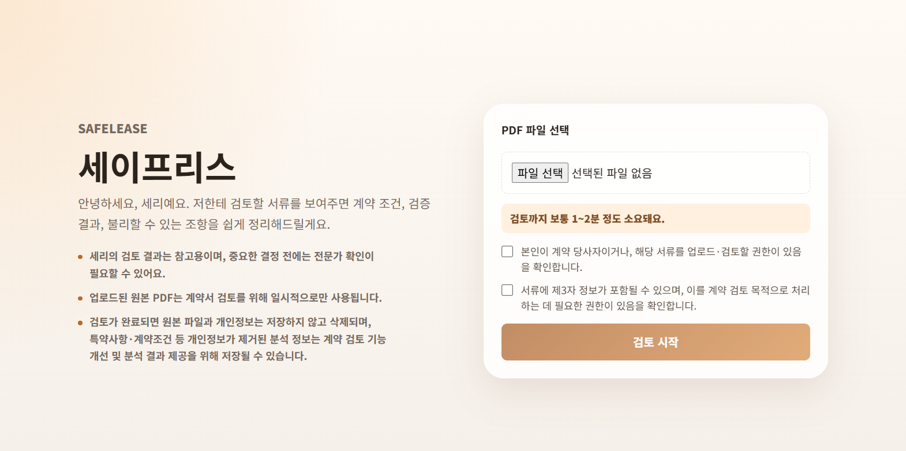
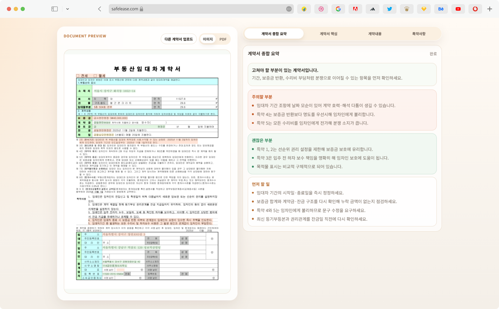
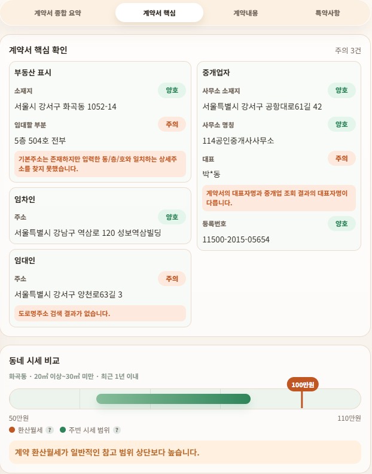
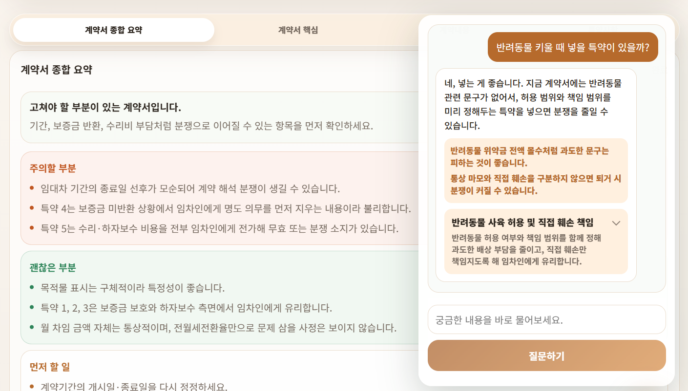
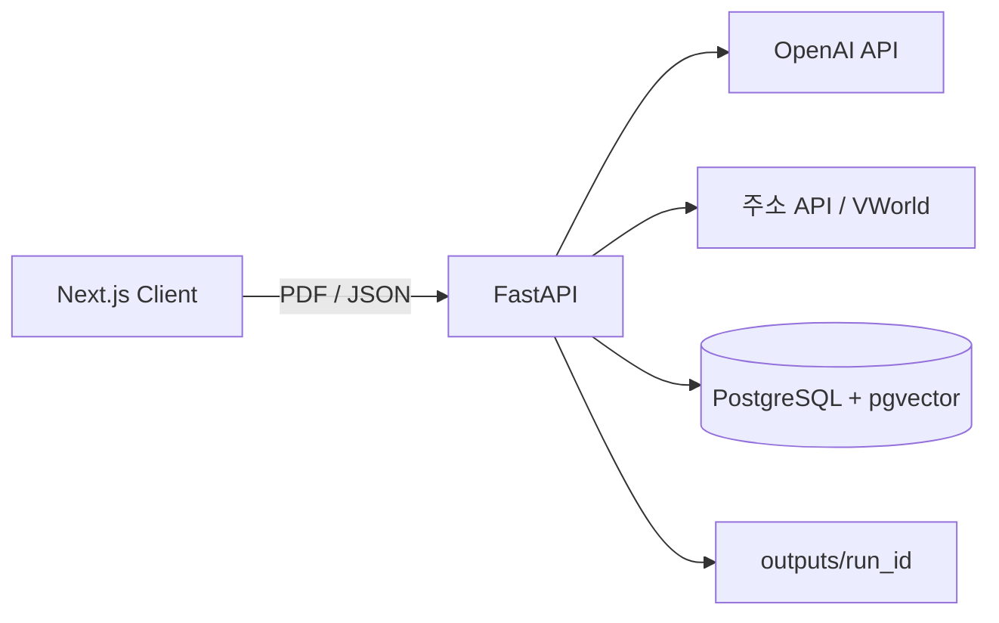

# SafeLease

임대차 계약서 PDF에서 계약 정보를 추출하고, 주소·중개업·임대료 참고 데이터와 법령 근거를 함께 검토하는 웹 애플리케이션입니다. 분석 과정의 단계별 산출물과 PDF 원문 좌표를 보관해 결과의 근거를 다시 확인할 수 있도록 구성했습니다.

> SafeLease는 법률 자문 서비스가 아닙니다. 계약 전 확인할 항목과 참고 근거를 정리하는 보조 도구이며, 개발과 검증에는 가상의 계약서만 사용했습니다.

<p align="center">
  
</p>

## 문서

- [API 명세](docs/API.md): 엔드포인트, 요청·응답, 오류 조건, 내부 호출 흐름
- [아키텍처](docs/ARCHITECTURE.md): 18단계 분석 파이프라인, 모듈 책임, 데이터 저장 구조, 외부 연동
- [백엔드 상세 문서](backend/README.md): 함수와 검증 규칙 중심의 구현 설명

## 현재 상태

- 개인 프로젝트로 기획, 프런트엔드, 백엔드, 데이터 처리 로직을 구현했습니다.
- 실제 서버에 배포하지 않았으며 로컬 실행을 전제로 합니다.
- 분석 요청은 작업 큐나 진행률 폴링 없이 하나의 HTTP 요청 안에서 동기적으로 처리됩니다.
- 분석 기록은 사용자 계정이나 DB가 아니라 `backend/outputs/{run_id}`에 파일로 저장됩니다.
- 사용자 인증, 기록별 접근 제어, 자동 만료·삭제 정책은 구현되어 있지 않습니다.

## 주요 기능

### 계약서 구조화

PDF를 OpenAI 파일 저장소에 올리고 `gpt-5.4-mini`로 계약 유형, 목적물, 계약 당사자, 금액, 기간, 계약조건, 특약을 JSON으로 추출합니다. 모델 응답에 코드 블록이나 설명문이 섞이거나 escape가 깨진 경우 첫 JSON 객체 추출과 문자열 보정을 거쳐 재파싱합니다.

추출 과정에서는 원문 표현과 정규화 값을 함께 유지합니다. 예를 들어 금액은 `raw_text`, `korean_text`, `numeric_text`, `normalized_value`로 나누며, 전세·월세 유형은 금액을 보고 추론하지 않고 계약서의 체크 표시만 사용합니다.

### 외부 데이터 교차 검증

- 도로명주소 API로 목적물·임대인·임차인 주소를 확인합니다.
- 목적물의 동·층·호를 분리해 상세주소 목록과 비교합니다.
- VWorld 부동산중개업 페이지를 Selenium으로 조회해 등록번호, 상호, 소재지, 대표자를 비교합니다.
- 계약 보증금과 월세를 환산월세로 변환하고 PostgreSQL의 지역·면적별 분위 통계와 비교합니다.

외부 조회 결과는 `success`, `not_found`, `partial_match`, `query_failed`로 구분합니다. 정보가 없는 경우와 외부 시스템 호출 자체가 실패한 경우를 같은 결과로 처리하지 않습니다.

### 법령 RAG와 근거 재검토

계약조건과 특약을 검색 단위로 나누고 `text-embedding-3-small` 임베딩으로 법령·가이드·특약 후보를 검색합니다. 주제 규칙, 법조문 우선순위, token overlap, 벡터 유사도를 조합해 재정렬한 후 `gpt-5.4-mini`가 계약조건과 특약을 분석합니다.

분석에 사용된 법령 후보는 별도의 LLM 호출로 `direct`, `supporting`, `irrelevant` 중 하나로 다시 분류합니다. 2차 검증이 실패하면 해당 상태를 결과에 남기며 최초 분석 결과 전체를 폐기하지는 않습니다.

### PDF 원문 연결과 개인정보 마스킹

PyMuPDF로 PDF의 word·line·block 좌표를 인덱싱하고 분석 항목의 `field_path`를 원문 위치와 연결합니다. 판정 수준에 따라 annotation이 포함된 PDF와 PNG 미리보기를 생성합니다.

공개 결과 JSON과 하이라이트 산출물에는 이름, 주민등록번호, 전화번호를 마스킹합니다. 로컬 임시 PDF는 요청 완료 후 삭제하지만 OpenAI에 업로드한 파일의 명시적 삭제 처리, 산출물 보관 기한, 사용자별 접근 제어는 아직 구현되어 있지 않습니다.

### 분석 기록과 질의응답

완료된 분석은 실행별 디렉터리에 저장합니다. 기록 목록과 상세 조회 API는 이 디렉터리를 읽어 결과를 복원합니다. 챗봇은 클라이언트가 전달한 임의 파일을 읽지 못하도록 `/outputs/` 아래의 `combined_result.json`만 컨텍스트로 허용합니다.

<p align="center">
  
</p>

<p align="center">
  
</p>

<p align="center">
  
</p>

## 시스템 구성



FastAPI가 전체 분석을 조정합니다. 계약서 추출과 법령 분석은 OpenAI API를 사용하고, 주소·중개업 정보는 외부 시스템에서 확인합니다. PostgreSQL은 임대료 참고 통계와 RAG 검색 데이터를 제공하며, 최종 분석 기록과 PDF 산출물은 파일 시스템에 저장합니다.

자세한 단계와 모듈 관계는 [아키텍처 문서](docs/ARCHITECTURE.md)를 참고하세요.

## API 요약

| Method | Endpoint | 역할 |
|---|---|---|
| `GET` | `/health` | 서버 상태 확인 |
| `POST` | `/api/contracts/verify` | PDF 업로드 및 전체 분석 실행 |
| `GET` | `/api/contracts/history` | 파일 시스템에 저장된 분석 기록 목록 조회 |
| `GET` | `/api/contracts/history/{history_id}` | 특정 분석 기록 복원 |
| `POST` | `/api/contracts/chat` | 저장된 분석 결과 기반 질의응답 |

전체 요청·응답과 오류 조건은 [API 명세](docs/API.md)에 정리했습니다. FastAPI 기본 문서는 서버 실행 후 `http://127.0.0.1:8000/docs`에서 확인할 수 있습니다.

## 기술 스택

| 영역 | 기술 |
|---|---|
| Frontend | Next.js 16.2.4, React 19.2.4, TypeScript 5, Tailwind CSS 4 |
| Backend | Python, FastAPI, Uvicorn |
| Database | PostgreSQL, pgvector, psycopg 3 |
| AI | OpenAI API, `gpt-5.4-mini`, `text-embedding-3-small`, RAG |
| Document | PyMuPDF (`fitz`) |
| External integration | 도로명주소 API, VWorld, Selenium |

## 디렉터리 구조

```text
safelease/
├── backend/
│   ├── app/
│   │   ├── api.py                 # FastAPI 엔드포인트
│   │   ├── core/                  # 환경설정, 파일 저장, 단계 로그
│   │   ├── presenters/            # 내부 결과를 API 응답으로 변환
│   │   ├── services/              # 추출, 검증, RAG, PDF, 챗봇
│   │   └── validators/            # 주소·중개업 외부 검증
│   ├── main.py                    # CLI 진입점
│   ├── run_backend_check.py       # 전체 파이프라인 smoke check
│   └── requirements.txt
├── frontend/
│   └── src/
│       ├── app/                   # 업로드, 분석, 결과, 기록 페이지
│       ├── components/            # 결과·미리보기·챗봇 UI
│       ├── context/               # 클라이언트 분석 상태
│       ├── lib/                   # API 호출과 표시 형식
│       └── types/                 # API 응답 타입
└── docs/
    ├── API.md
    ├── ARCHITECTURE.md
    └── images/
```

## 로컬 실행

### 요구 환경

- Python 3.10 이상 권장
- Node.js 20 이상 권장
- PostgreSQL과 pgvector 확장
- Chrome 또는 Chromium과 호환되는 ChromeDriver
- OpenAI API 키와 도로명주소 API 키 2종
- RAG 및 임대료 참고 테이블이 적재된 데이터베이스

> 현재 `backend/requirements.txt`에는 코드가 사용하는 `PyMuPDF`가 포함되어 있지 않습니다. 하이라이트 기능을 실행하려면 별도로 설치해야 합니다. 의존성 버전도 고정되어 있지 않아 재현 가능한 설치 파일로는 아직 불완전합니다.

### Backend

```bash
cd backend
python -m venv .venv
```

macOS/Linux:

```bash
source .venv/bin/activate
```

Windows PowerShell:

```powershell
.venv\Scripts\Activate.ps1
```

```bash
python -m pip install -r requirements.txt
python -m pip install PyMuPDF
```

`backend/.env`를 생성합니다.

```env
OPENAI_API_KEY=
JUSO_ROAD_API_KEY=
JUSO_DETAIL_API_KEY=

# DATABASE_URL 또는 아래 개별 설정 사용
DATABASE_URL=
POSTGRES_HOST=localhost
POSTGRES_PORT=5433
POSTGRES_DB=rent
POSTGRES_USER=
POSTGRES_PASSWORD=

# 선택: 추출 원문과 복구 결과 저장
SAFELEASE_DEBUG_EXTRACTION=0
```

```bash
uvicorn app.api:app --reload
```

백엔드는 기본적으로 `http://127.0.0.1:8000`에서 실행됩니다.

### Frontend

```bash
cd frontend
npm ci
```

필요하면 `frontend/.env.local`에 백엔드 주소를 설정합니다.

```env
NEXT_PUBLIC_API_BASE_URL=http://127.0.0.1:8000
```

```bash
npm run dev
```

프런트엔드는 기본적으로 `http://localhost:3000`에서 실행됩니다. 백엔드 CORS도 현재 `localhost:3000`과 `127.0.0.1:3000`만 허용합니다.

### CLI smoke check

외부 API와 데이터베이스 설정을 마친 뒤 가상 계약서로 전체 파이프라인을 실행할 수 있습니다.

```bash
cd backend
python run_backend_check.py /path/to/virtual-contract.pdf
```

이 스크립트는 mock 테스트가 아니라 실제 OpenAI·외부 API·DB를 호출하는 통합 실행 도구입니다.


## 개선 방향

- 분석 작업을 비동기 큐로 분리하고 작업 상태·재시도·취소 API 제공
- 인증, 분석 기록 소유권, 다운로드 권한, 자동 만료·삭제 정책 구현
- 파일 크기·MIME·페이지 수 제한과 악성 파일 검사 추가
- 외부 API와 OpenAI를 대체하는 mock 기반 단위·통합 테스트 구축
- DB migration과 seed 스크립트, 고정된 의존성 및 컨테이너 실행 환경 제공
- 법률 전문가가 검토한 평가셋으로 추출·검색·근거 적합성 평가

## Disclaimer

SafeLease가 제공하는 내용은 임대차 계약 검토를 돕기 위한 참고 정보입니다. 변호사, 공인중개사 등 전문가의 법률·중개 자문을 대체하지 않습니다.
